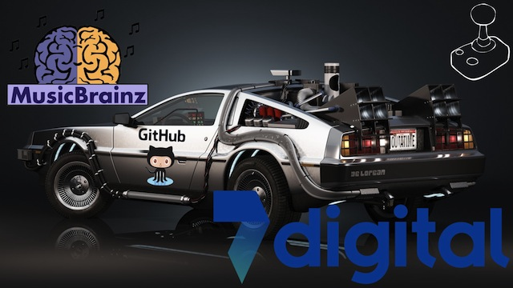

Music Hack Day London 2014
==========================

## FFTM (Fast Forward Time Machine)

[https://www.hackerleague.org/hackathons/music-hack-day-london-2014/hacks/fftm-fast-forward-time-machine](https://www.hackerleague.org/hackathons/music-hack-day-london-2014/hacks/fftm-fast-forward-time-machine)

## Who made this?

[Aristotel Digenis @greekgoddj](http://www.twitter.com/greekgoddj)

[Jorge Garcia @JGarciaMartin](http://www.twitter.com/JGarciaMartin)

## What is this?

Travel in time! A python command line application that allows time travel with your favourite artist.
 
A DJ narration also supports your journey introducing each of the songs you hear in your trip.

### Usage:

python fftm.py "Bob Marley"

## What APIs were used?

We use MusicBrainz API to access data from the artist (like the years being active), and the 7Digital API to download the preview
tracks that you hear in your journey, also matching each the years passed.

Say OSX API is also used in the text to speech generation for the DJ.

Some sounds from Freesound are also used to smooth out the leaps in time.

[We also added the Back to the Future soundtrack, because... you know... it's still quite cool!](https://www.youtube.com/watch?v=e8TZbze72Bc)

## What tools were used?

We love Python and PyCharm... so, that was it. 
